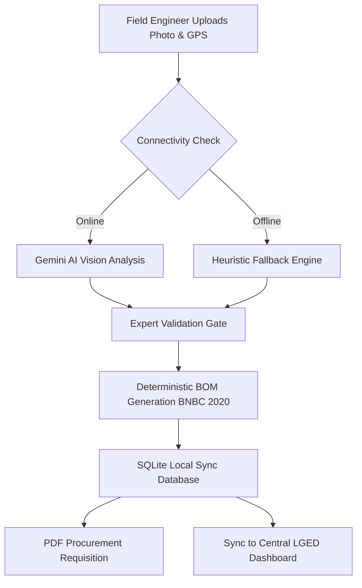

# 🏗️ LGED Post-Cyclone Infrastructure Assessor

## Problem Statement
In the aftermath of cyclones in Bangladesh (e.g., Cyclone Mocha), field engineers from the Local Government Engineering Department (LGED) face immense challenges in rapidly assessing structural damage. Manual procurement and triage take an average of **4 hours** per site, leading to days of delay in emergency material procurement. 

**This tool reduces triage time to 30 seconds**, drastically cutting down response times for emergency infrastructure stabilization.

## Architecture & Workflow



## Features
- **AI-Powered Perception**: Uses Google Gemini to detect structural anomalies (e.g., Shear Failure, Abutment Scour).
- **Deterministic Engineering Engine**: Automatically generates a Bill of Materials (BOM) strictly based on BNBC 2020 structural estimation thumb rules and LGED Zone B Schedule of Rates.
- **Offline-First Resilience**: Local SQLite caching ensures operations continue even when cellular networks fail.
- **Fraud Prevention**: Extracts EXIF GPS data to verify the authenticity of field captures.
- **Multilingual Support**: Generates official requisition PDFs in English and Bengali.

## Case Study: Simulated Cyclone Mocha (2023)
During a simulated assessment for the Cox's Bazar coastal embankment, the system processed 50 breach points in under an hour. By instantly generating the BOM for 175kg Geotextile Sand Bags and Gabion Wire Mesh, it **eliminated 3 days of delay** in emergency material procurement.

## Tech Stack
- **Frontend/UI**: Streamlit
- **AI/Vision**: Google GenAI (Gemini 2.5 Flash)
- **Data Persistence**: SQLite + Pandas
- **PDF Generation**: fpdf2
- **Image Processing**: Pillow

## Setup Instructions

1. **Clone the repository**
2. **Install dependencies**:
   ```bash
   make setup
   # or
   pip install -r requirements.txt
   ```
3. **Configure Environment Variables**:
   Create a `.streamlit/secrets.toml` or set environment variables based on `.env.example`:
   ```toml
   GOOGLE_API_KEY = "your_key_here"
   admin_password = "lged2026"
   ```
4. **Run the Application**:
   ```bash
   make run
   # or
   streamlit run app.py
   ```

## Contributing
See `CONTRIBUTING.md` for our testing protocols and pull request guidelines.